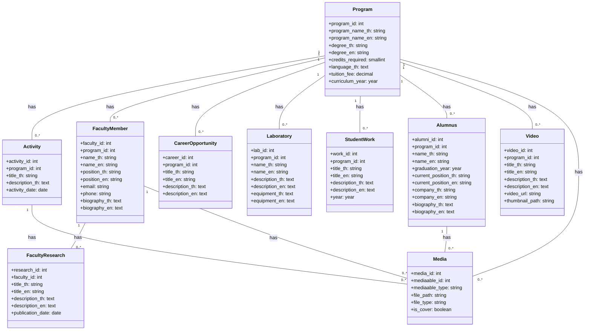

# Visual Class Diagram

## Mermaid.js Class Diagram

```mermaid
classDiagram
class Program {
+program_id: int
+program_name_th: string
+program_name_en: string
+degree_th: string
+degree_en: string
+credits_required: smallint
+language_th: text
+tuition_fee: decimal
+curriculum_year: year
}

class Activity {
+activity_id: int
+program_id: int
+title_th: string
+description_th: text
+activity_date: date
}

class FacultyMember {
+faculty_id: int
+program_id: int
+name_th: string
+name_en: string
+position_th: string
+position_en: string
+email: string
+phone: string
+biography_th: text
+biography_en: text
}

class CareerOpportunity {
+career_id: int
+program_id: int
+title_th: string
+title_en: string
+description_th: text
+description_en: text
}

class Laboratory {
+lab_id: int
+program_id: int
+name_th: string
+name_en: string
+description_th: text
+description_en: text
+equipment_th: text
+equipment_en: text
}

class StudentWork {
+work_id: int
+program_id: int
+title_th: string
+title_en: string
+description_th: text
+description_en: text
+year: year
}

class Alumnus {
+alumni_id: int
+program_id: int
+name_th: string
+name_en: string
+graduation_year: year
+current_position_th: string
+current_position_en: string
+company_th: string
+company_en: string
+biography_th: text
+biography_en: text
}

class Video {
+video_id: int
+program_id: int
+title_th: string
+title_en: string
+description_th: text
+description_en: text
+video_url: string
+thumbnail_path: string
}

class FacultyResearch {
+research_id: int
+faculty_id: int
+title_th: string
+title_en: string
+description_th: text
+description_en: text
+publication_date: date
}

class Media {
+media_id: int
+mediaable_id: int
+mediaable_type: string
+file_path: string
+file_type: string
+is_cover: boolean
}

Program "1" -- "0..*" Activity : has
Program "1" -- "0..*" FacultyMember : has
Program "1" -- "0..*" CareerOpportunity : has
Program "1" -- "0..*" Laboratory : has
Program "1" -- "0..*" StudentWork : has
Program "1" -- "0..*" Alumnus : has
Program "1" -- "0..*" Video : has
Program "1" -- "0..*" Media : has

FacultyMember "1" -- "0..*" FacultyResearch : has
FacultyMember "1" -- "0..*" Media : has

Activity "1" -- "0..*" Media : has
Alumnus "1" -- "0..*" Media : has
```
