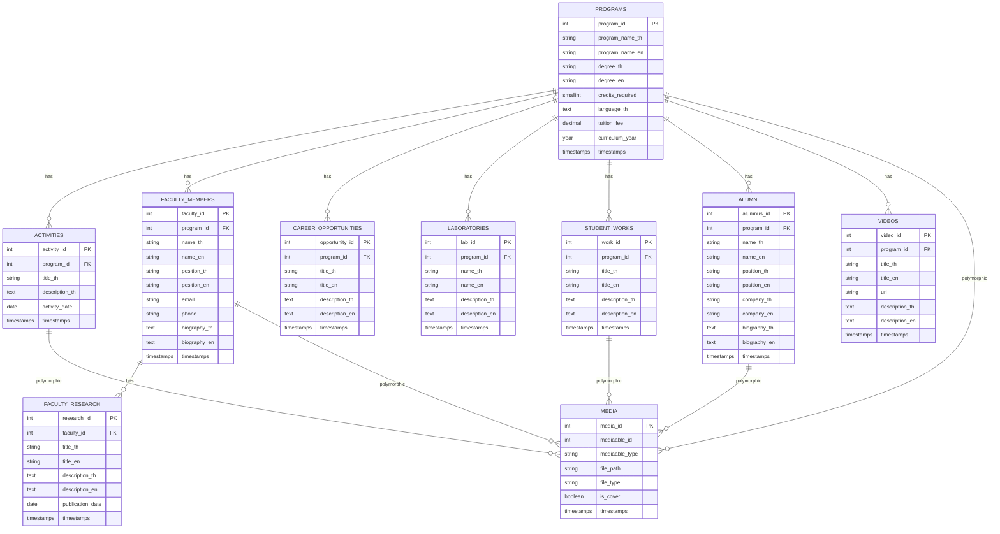

# ER Diagram

```mermaid
erDiagram
PROGRAMS ||--o{ ACTIVITIES : has
PROGRAMS ||--o{ FACULTY_MEMBERS : has
PROGRAMS ||--o{ CAREER_OPPORTUNITIES : has
PROGRAMS ||--o{ LABORATORIES : has
PROGRAMS ||--o{ STUDENT_WORKS : has
PROGRAMS ||--o{ ALUMNI : has
PROGRAMS ||--o{ VIDEOS : has

FACULTY_MEMBERS ||--o{ FACULTY_RESEARCH : has

PROGRAMS ||--o{ MEDIA : "polymorphic"
ACTIVITIES ||--o{ MEDIA : "polymorphic"
FACULTY_MEMBERS ||--o{ MEDIA : "polymorphic"
ALUMNI ||--o{ MEDIA : "polymorphic"
STUDENT_WORKS ||--o{ MEDIA : "polymorphic"

PROGRAMS {
int program_id PK
string program_name_th
string program_name_en
string degree_th
string degree_en
smallint credits_required
text language_th
decimal tuition_fee
year curriculum_year
timestamps timestamps
}

ACTIVITIES {
int activity_id PK
int program_id FK
string title_th
text description_th
date activity_date
timestamps timestamps
}

FACULTY_MEMBERS {
int faculty_id PK
int program_id FK
string name_th
string name_en
string position_th
string position_en
string email
string phone
text biography_th
text biography_en
timestamps timestamps
}

FACULTY_RESEARCH {
int research_id PK
int faculty_id FK
string title_th
string title_en
text description_th
text description_en
date publication_date
timestamps timestamps
}

CAREER_OPPORTUNITIES {
int opportunity_id PK
int program_id FK
string title_th
string title_en
text description_th
text description_en
timestamps timestamps
}

LABORATORIES {
int lab_id PK
int program_id FK
string name_th
string name_en
text description_th
text description_en
timestamps timestamps
}

STUDENT_WORKS {
int work_id PK
int program_id FK
string title_th
string title_en
text description_th
text description_en
timestamps timestamps
}

ALUMNI {
int alumnus_id PK
int program_id FK
string name_th
string name_en
string position_th
string position_en
string company_th
string company_en
text biography_th
text biography_en
timestamps timestamps
}

VIDEOS {
int video_id PK
int program_id FK
string title_th
string title_en
string url
text description_th
text description_en
timestamps timestamps
}

MEDIA {
int media_id PK
int mediaable_id
string mediaable_type
string file_path
string file_type
boolean is_cover
timestamps timestamps
}
```
